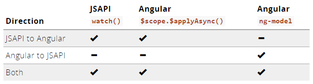
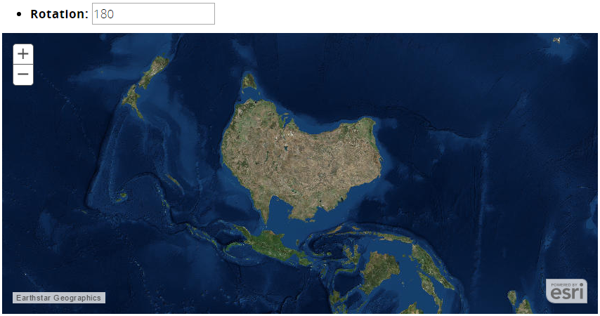

## Do I really have to deal with `$scope` and the digest cycle?

---

> KEEP CALM WITH THE DIGEST CYCLE & CARRY ON

(for the most part, but...)

---

## [Property binding](http://esri.github.io/angular-esri-map/#/patterns/property-binding)
## between Angular and JSAPI

[](http://esri.github.io/angular-esri-map/#/patterns/property-binding)

---

## Demo: Property Binding

[](http://esri.github.io/angular-esri-map/#/examples/property-binding)

---

## When to also consider `$scope.$apply`

- JSAPI async operations

  - _using_ `esri/tasks/QueryTask`, `esri/geometry/geometryEngineAsync`, etc. ...

  - ... and then _updating_ data models bound to Angular

---

## When to think about `$scope.$on`

- Destroy JSAPI widgets when Angular scope is also being destroyed

```javascript
// from the Search Widget example
$scope.$on('$destroy', function() {
    searchWidget.destroy();
});
```
