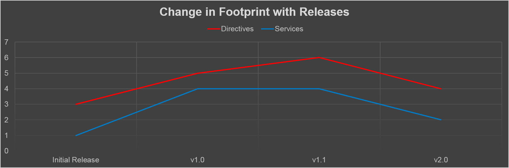

    
    <i class="fa fa-heart fragment" style="display: inline-block; font-size: 200px; color: red;"></i>
    

<h3 class="fragment">This should get easier over time</h3>

---

<!-- .slide: data-background="reveal.js/img/bg-5.png" -->
## <i class="fa fa-exclamation-triangle"></i> Road Ahead

May not quite be ready for production apps

---

<!-- .slide: data-background="img/angular-esri-map-v1-screenshot.png" -->
#### We have a production ready solution

---

<!-- .slide: data-background="img/angular-esri-map-v1-screenshot.png" -->
#### [angular-esri-map](https://github.com/Esri/angular-esri-map/) (Angular 1.x only)

---

<!-- .slide: data-background="img/angular-esri-map-v1-screenshot.png" -->
#### *will* support JSAPI 4.x

---

## [angular-esri-map](https://github.com/Esri/angular-esri-map/) Roadmap

<!-- .slide: data-background="reveal.js/img/bg-5.png" -->
<table>
    <tr><td>angular-esri-map </td><td> Angular </td><td> ArcGIS API for JavaScript</td></tr>
    <tr><td>v1.0 </td><td> v1.3+ </td><td> [v3.12+](https://developers.arcgis.com/javascript/)</td></tr>
    <tr><td>v1.1 </td><td> v1.3+ </td><td> [v3.15+](https://developers.arcgis.com/javascript/)</td></tr>
    <tr><td>v2.xbeta </td><td> v1.3+ </td><td> [v4.0beta3+](https://developers.arcgis.com/javascript/beta/)</td></tr>
</table>

Will *not* support Angular 2.x

---

<!-- .slide: data-background="reveal.js/img/bg-3.png" -->
## [angular-esri-map](https://github.com/Esri/angular-esri-map/) 2.x

ArcGIS API v 4.x in Angular 1.x apps

---

<!-- .slide: data-background="reveal.js/img/bg-6.png" -->
## Decreasing footprint of [angular-esri-map](https://github.com/Esri/angular-esri-map/)

---

<!-- .slide: data-background="reveal.js/img/bg-3.png" -->
## Fewer Directives

- ~~`<esri-map />`~~ <i class="fa fa-arrow-right"></i> `<esri-map-view />` or `<esri-scene-view />`
- Only for objects with a UI footprint (dropped layer directives)

---

<!-- .slide: data-background="reveal.js/img/bg-3.png" -->
## Services are Central

- `esriLoader` and `esriRegistry` expose same API
- `esriLoader` becomes more central
